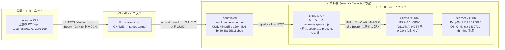
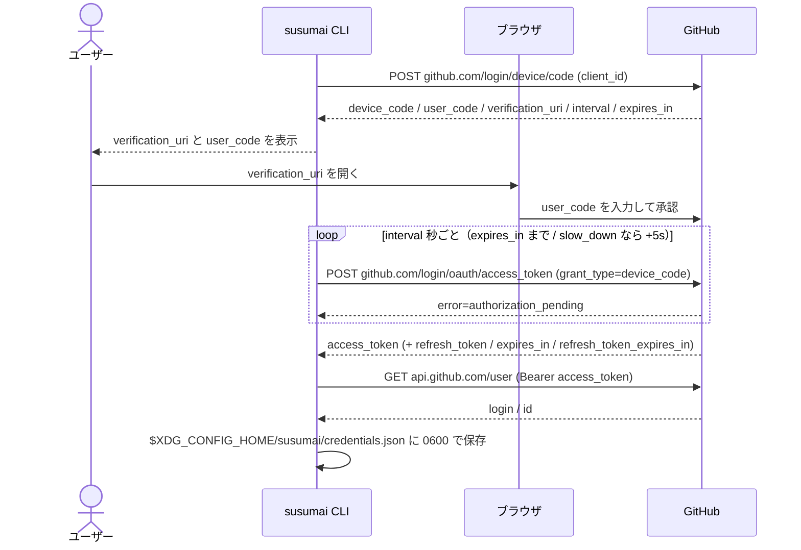
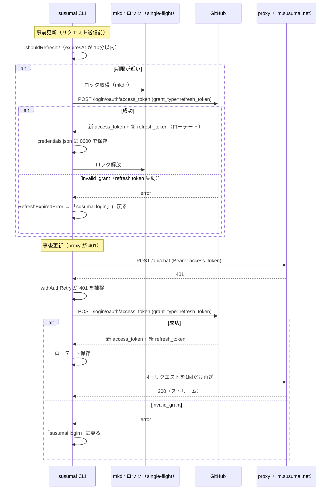
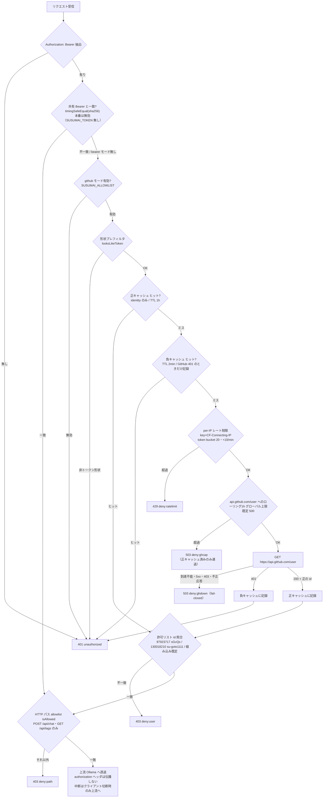
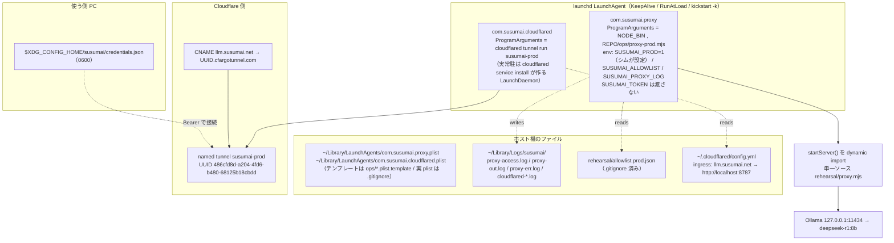

# ARCHITECTURE — susumai

この文書は構造の地図（図が主・説明は従）。手順は `QUICKSTART.md` / `HOSTING.md`、仕様の正は `rehearsal/proxy.mjs` 冒頭コメント。

- 使う側: `susumai` CLI（任意の PC / npm `susumai@0.2.0` / zero-dep）。ローカル LLM とチャットするだけ（道具なし・Claude Code ではない）。
- 認証: GitHub OAuth App（Device Authorization Grant / client_id `Ov23liuaEuBGcxLCPA3T` / Client Secret 不要）。access token 8h / refresh token 約6ヶ月。
- 詳細の正: proxy 仕様 = `rehearsal/proxy.mjs` 冒頭コメント / ホスト構築 = `ops/README.md` + Vault `50_Meta/Gamebook_susumai_auth` / 使う側 = `QUICKSTART.md` / ホスト運用 = `HOSTING.md`。

---

## 1. システム全体像 / リクエスト経路

CLI から Ollama までの経路と信頼境界。Bearer トークンは公開インターネット〜proxy まで運ばれ、proxy が上流 Ollama へは `authorization` ヘッダを伝播しない（そこで消える）。

> 経路上の env・キャッシュ TTL・拒否理由コードの正は `rehearsal/proxy.mjs` 冒頭コメント。

---

## 2. ログイン（Device Flow）のシーケンス

`susumai login`。CLI が自前で GitHub Device Authorization Grant を実行する（ブラウザ自動起動なし・URL とコードを表示するだけ）。

`credentials.json` の形（`github` キー配下）: `token` / `login` / `id` / `obtainedAt`、自動更新の実装で `refreshToken` / `expiresAt` / `refreshTokenExpiresAt` / `clientId` を追加。PAT フォールバックは `config.json` の `token`。

> 純関数の分類ロジックは `src/auth.ts`、保存は `src/credentials.ts`。設計の正は Vault `50_Meta/Gamebook_susumai_auth`。

---

## 3. トークン自動更新のシーケンス（実装進行中・設計承認済み）

事前更新（送信前に期限が近ければ refresh）と事後更新（proxy が 401 を返したら refresh して1回だけ再送）。`POST github.com/login/oauth/access_token`（`grant_type=refresh_token`）。refresh token は単回使用でローテート。同時実行は mkdir ロックで single-flight。

> refresh の HTTP は `src/auth.ts` の `refreshAccessToken`、401 リトライは `src/client.ts` の `withAuthRetry`（`src/errors.ts` の `RefreshExpiredError`）。設計の正は Vault `50_Meta/Gamebook_susumai_auth`。

---

## 4. proxy の認証判定フロー

Bearer 抽出 → 認証（OR）→ HTTP パス allowlist。各葉に拒否理由コードと HTTP ステータス。認証 OK でも `isAllowed(method, path)` はスキップしない。

> しきい値の env 名・既定値、fail-closed 境界の正は `rehearsal/proxy.mjs` 冒頭コメント。本番アクセスログは `~/Library/Logs/susumai/proxy-access.log`（`rehearsal/proxy.log` と分離）。

---

## 5. ホストのデプロイ構成

launchd LaunchAgent 2つ（`KeepAlive` / `RunAtLoad`、`launchctl kickstart -k` で1インスタンスに収束）。proxy には `SUSUMAI_TOKEN` を渡さない = github モードのみ。

> 構築手順（`cloudflared tunnel create` / `route dns` / `service install` / `launchctl`）は `ops/README.md` と Vault `50_Meta/Gamebook_susumai_auth`。運用は `HOSTING.md`。検証は `npm run rehearse`（`rehearsal/rehearse.mjs`、quick tunnel ＋ 共有 Bearer の開発用。本番 proxy 稼働中は `:8787` 占有として HALT）。

---

この文書は構造の地図。手順は QUICKSTART / HOSTING、仕様の正は proxy.mjs 冒頭コメント。
